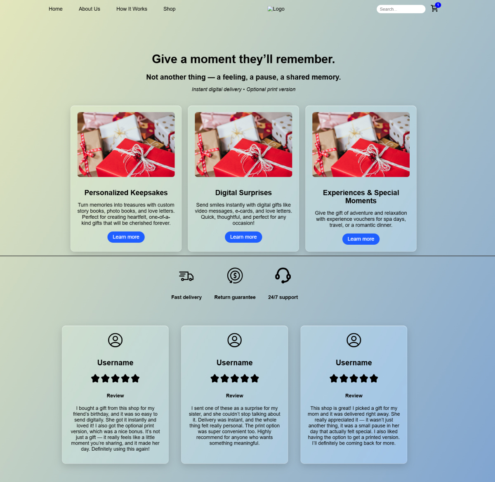
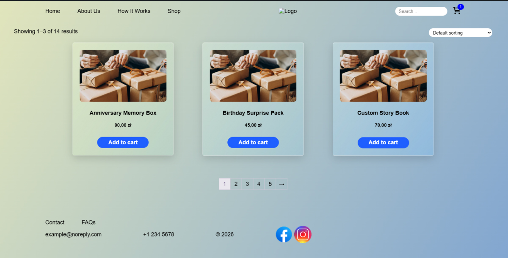

# giftshop
# My WordPress Theme

Demo of custom WordPress theme with WooCommerce support.

## Tech Stack
- WordPress
- WooCommerce
- PHP
- HTML5/CSS
- Custom Gutenberg blocks support

## WooCommerce Features
- Custom shop page
- Product card customization
- Support for variable products

## Screenshots

## Installation
1. Download or clone repository
2. Copy folder to `wp-content/themes`
3. Activate theme in WordPress admin
4. Install WooCommerce

## Notes
This theme is made for portfolio and demo purposes. 
